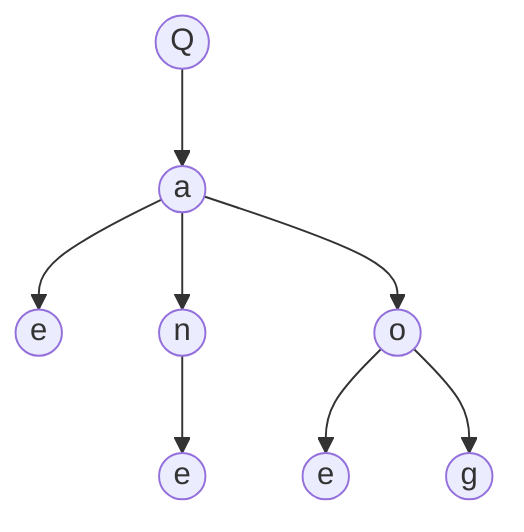

# Query Binder

> `Q` is another specialization of the binder pattern.
> Here the shared surface is a query or predicate interface.

## 1. Binder Assignment

Let:

$$
Q
$$

denote a query binder.

Any valid predicate-form belongs to that binder:

$$
q : Q
$$

So a query structure may grow without coupling directly to one concrete operator shape.

---

## 2. Symbols

Leaves:

$$
\ell \in \{ e, g, h \}
$$

where:

- `e` = equality test
- `g` = greater-than test
- `h` = contains / has test

Composites:

$$
c \in \{ a, o \}
$$

where:

- `a` = and
- `o` = or

Decorator:

$$
d = n
$$

where:

- `n` = not

So:

$$
e,g,h,a,o,n : Q
$$

under the binder reading.

---

## 3. Structural Constraints

Decorator form:

$$
n\{q\} : Q
$$

Composite form:

$$
a[q_1,\dots,q_n] : Q,
\qquad
o[q_1,\dots,q_n] : Q
$$

So the binder admits:

- leaf predicates
- grouped predicates
- wrapped predicates

all through the same interface `Q`.

---

## 4. Factual Example

A concrete query may be written as:

$$
\chi
=
a[
e(\text{status}, \text{"open"}),
\;
n\{e(\text{archived}, \text{true})\},
\;
o[
e(\text{priority}, \text{"high"}),
\;
g(\text{score}, 90)
]
]
$$

and still:

$$
\chi : Q
$$

So one root query may combine:

- direct tests
- negation
- grouped alternatives

without leaving the binder family.

---

## 5. Geometry

This geometry shows the same two axes:

- composite growth through `a` and `o`
- decorator growth through `n`

So the binder pattern is not limited to type systems.

---

## 6. Connection

This note is another specialization of [05-carbon-binder.md](05-carbon-binder.md):

$$
C \Rightarrow Q
$$

Together with [06-type-binder.md](06-type-binder.md), it shows that the binder pattern can reappear in different structural domains.
