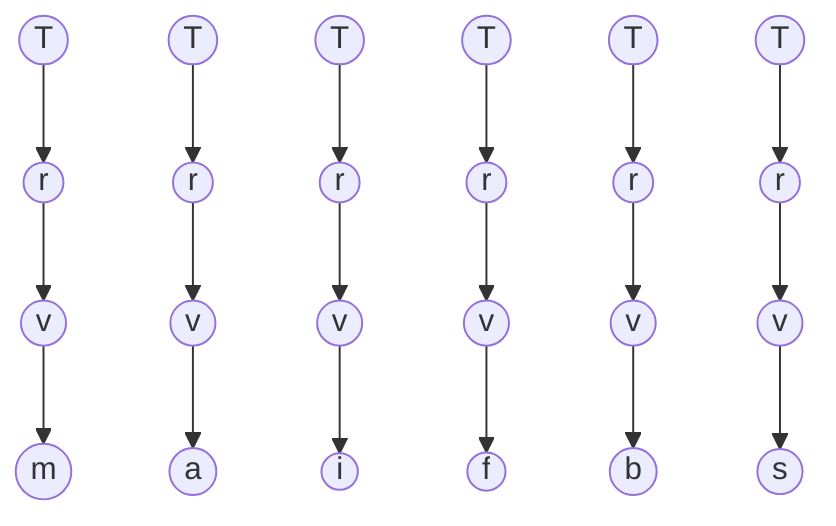

# Type Binder

> `T` is the binder for a type universe.
> Inside `T`, the type-shaped axis and the decorator axis remain distinct, but both are still admitted by the same binder.

## 1. Binder Assignment

Let:

$$
T
$$

denote the binder interface of the type system.

Any admitted form belongs to `T`:

$$
X : T
$$

So `T` is the whole grouping surface.

---

## 2. Axes Inside `T`

The grouping may be read as:

```text
T
|- type axis      = t
|  |- leaves      = l
|  `- composites  = c
`- decorator axis = d
```

So the distinction is:

- `T` = full binder
- `t` = type-shaped family inside `T`
- `d` = decorator family inside `T`

The type axis splits again into:

$$
t ::= l \mid c
$$

with:

$$
l \in \{ i, f, b, s \}
$$

and:

$$
c \in \{ m, a \}
$$

where:

- `i` = int
- `f` = float
- `b` = bool
- `s` = string
- `m` = map of `T`
- `a` = array of `T`

The decorator axis may be written as:

$$
d \in \{ r, v \}
$$

where:

- `r` = remover
- `v` = validator

---

## 3. Structural Constraints

The clean recursive reading is:

$$
T ::= t \mid d\{T\}
$$

with:

$$
t ::= l \mid c[T_1,\dots,T_n]
$$

This says:

- a `T` may be directly type-shaped
- or a `T` may be a decorator wrapping another `T`
- a composite type belongs to the type axis
- but its children may be any `T`

So the two main constraints are:

$$
d\{X\} : T
\qquad \text{with} \qquad
X : T
$$

and:

$$
c[X_1,\dots,X_n] : t
\qquad \text{with} \qquad
X_i : T
$$

This captures the intended asymmetry:

- `d` wraps exactly one `T`
- `c` contains one or many `T`

---

## 4. Orthogonality

The two axes do different work.

The type axis answers:

$$
\text{what kind of type-shape is this?}
$$

so it gives:

- leaf
- composite

The decorator axis answers:

$$
\text{what wrapper layers are placed on top of that type-shape?}
$$

so it gives:

- vertical stacking through `d{T}`

That is why they are orthogonal:

- `t` gives the type geometry
- `d` gives the wrapper geometry

A decorator may wrap:

- a leaf
- a composite
- another decorator

So:

$$
d^k\{t\} : T
$$

is always structurally valid.

In this note, we only care about meaningful decorator forms, that is, decorators actually bound to some inner `T`.

---

## 5. Consequences

Because composites contain `T`, not only bare `t`, they may hold:

- plain leaves
- plain composites
- decorated leaves
- decorated composites

So forms like these are all valid:

$$
i : T
$$

$$
v\{i\} : T
$$

$$
r\{v\{i\}\} : T
$$

$$
a[i,\; r\{v\{f\}\},\; b,\; s] : T
$$

$$
m[\text{x}: r\{v\{i\}\},\; \text{y}: r\{v\{a[i,f]\}\}] : T
$$

So the binder stays stable while the two axes combine.

---

## 6. Diagram Translation

The most compressed structural reading is:

```text
T
|
d
|
t
```

That is:

- `T` is the binder
- `d` is the wrapper axis
- `t` is the eventual type-shaped base

An unfolded family view may be sketched as:

```text
           T       T
           |       |
           r       r
           |       |
           v       v
           |       |
           m       a

      T    T    T    T
      |    |    |    |
      r    r    r    r
      |    |    |    |
      v    v    v    v
      |    |    |    |
      i    f    b    s
```

This does not mean that every structure must look exactly like this.
It only makes the axes visible:

- top row: decorated composites
- bottom row: decorated leaves

The same idea in a simple Mermaid-friendly translation:



---

## 7. Connection

This note is a specialization of [05-carbon-binder.md](05-carbon-binder.md):

$$
C \Rightarrow T
$$

So `T` is not a different pattern.
It is one domain-specific binder assignment.
