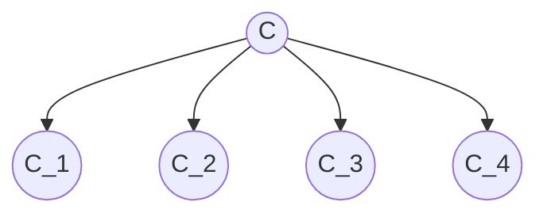

# Carbon Binder

> `C` denotes a common binder interface.
> The carbon analogy points to one reusable bonding surface that can generate many structures.

## 1. Binder Idea

Let:

$$
C
$$

denote a common binder.

Any concrete realization that complies with it belongs to the same structural world:

$$
x : C
$$

So the important thing is not the concrete species by itself, but the fact that interaction always happens through the same binder.

This gives three immediate properties:

- many concretions
- one common entry surface
- one common bonding rule

So `C` acts as cohesive glue.

---

## 2. Why "Carbon"

The analogy is structural.
Carbon can form:

- chains
- branches
- rings
- polymers

The same bonding capability can participate in many geometries.

Here the analogy is:

- carbon atom in chemistry
- binder interface `C` in software structure

We are not making a chemistry claim in detail.
We are only using the idea of a **highly reusable bonding element**.

---

## 3. Structural Rule

The core rule is:

$$
\text{interaction happens through } C
$$

So if:

$$
a : C,
\qquad
b : C,
\qquad
c : C
$$

then they may be composed before caring about their concrete species.

That shifts structure away from concrete coupling and toward binder-level compatibility.

In short:

$$
C \leadsto \text{cohesion} + \text{flexibility}
$$

---

## 4. Two Growth Axes

One reason `C` is powerful is that it supports more than one geometric direction.

### 4.1 Composite growth

A composite can contain many children, all admitted through `C`:

$$
\mathrm{Comp}(C_1, C_2, \dots, C_n) : C
$$

### 4.2 Decorator growth

A decorator can wrap one component and still remain in the same binder family:

$$
\mathrm{Dec}(C) : C
$$

### 4.3 Orthogonality

This produces two distinct structural axes:

- composite: one-to-many containment
- decorator: one-around-one wrapping

So:

$$
\text{leaf} : C,
\qquad
\mathrm{Comp}(\dots) : C,
\qquad
\mathrm{Dec}(\dots) : C
$$

Everything keeps coming back to `C`.

---

## 5. Minimal Geometry

The most compact picture is:

Here:

- `C` is the binder
- `C_k` means a concrete realization admitted by that binder
- the repeated relation is always `C -> C_k`

So the concrete family may vary, but the bonding surface remains stable.

---

## 6. Specialization Rule

`C` is the general pattern.
Specific domains may rename the binder.

For example:

$$
C \Rightarrow T
$$

when the binder is specialized to a type universe, or:

$$
C \Rightarrow Q
$$

when the binder is specialized to a query or predicate universe.

So `C` is the abstract binder idea, while symbols such as `T` or `Q` are domain-specific assignments.

---

## 7. Connection

This binder note sits beside the function notes, but it is more general:

- [F-01-function.md](../L-functions/F-01-function.md): a function as bounded unit
- [F-02-execution.md](../L-functions/F-02-execution.md): one interface admitting many executable forms
- [F-03-function-network.md](../L-functions/F-03-function-network.md): one graph relating many nodes
- [F-04-function-natural-wrappers.md](../L-functions/F-04-function-natural-wrappers.md): functions as natural wrappers

Several domain specializations follow:

- [F-02-type-binder.md](F-02-type-binder.md): `T` as a binder for a type system
- [F-03-query-binder.md](F-03-query-binder.md): `Q` as a binder for query structure
- [F-04-TLF-composite.md](F-04-TLF-composite.md): `K` as a corpus composite with traversal overlays
