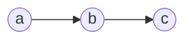
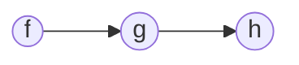
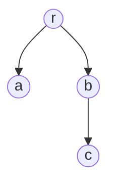

# Function Network

> Once functions are seen as nodes, composition becomes graph structure.
> A network does not replace the function; it relates functions.

## 1. Network View

Let a function network be modeled first as a directed graph:

$$
\mathcal{N} = (V, E)
$$

with node-labeling:

$$
\lambda_V : V \to \mathcal{F}
$$

so that each node $v_i \in V$ is assigned a function:

$$
\lambda_V(v_i) = F_i
$$

Each node-function keeps its own local ports:

$$
I_i, O_i
$$

These are the local acceptance / exposure surfaces of the node.
They are not themselves the full structural relation between nodes.

An edge between two nodes is the structural bond:

$$
e_{ij} : v_i \to v_j
$$

and can be read more specifically as a relation from the output side of one node to the input side of the next:

$$
e_{ij} : O_i \rightsquigarrow I_j
$$

If needed, the edge may carry a communication protocol or translation map:

$$
\lambda_E : E \to \Pi \cup \{id\}
$$

where:

$$
\lambda_E(e_{ij}) = \pi_{ij}
$$

and $\pi_{ij}$ expresses how packet communication is translated between neighboring nodes.

Here `id` means the **identity binder** or **identity map**, not an identifier.
It simply means that no translation is needed on that edge.

So:

- each node is a function
- each function keeps its own local ports
- an edge is not itself an I/O port
- an edge is the structural relation between nodes
- a protocol on the edge handles compatibility between neighboring domains

The pair $(\lambda_V,\lambda_E)$ is therefore the basic graph-to-function translation:

$$
V,E \leadsto F,\pi
$$

In that loose sense, it is natural to read this as a functor-like move:

- nodes are mapped to functions
- edges are mapped to binders / protocols

A tiny network can be sketched as:

Here `a`, `b`, `c` are function-nodes.
The arrows denote directed relation and possible flow.

This labeled-graph view is therefore already very close to the functor intuition.
A stricter categorical reading can come later if useful.

---

## 2. Pipeline as Path Graph

A pipeline is the simplest function network.
Graph-theoretically, it is a directed path:

$$
\mathcal{P}_n = F_1 \to F_2 \to \dots \to F_n
$$

or equivalently a path graph whose nodes are labeled by functions.

Operationally:

$$
\mathcal{P}_n
=
F_n \circ \pi_{n-1,n} \circ F_{n-1} \circ \dots \circ \pi_{1,2} \circ F_1
$$

At the packet level:

$$
\rho_i \xrightarrow{F_i} \rho_i' \xrightarrow{\pi_{i,i+1}} \rho_{i+1}
$$

Every stage is still a packet.
The packet does not become a different kind of thing at output.
Only its stage and compatibility relation change.

So the edge itself is the structural connection, while $\pi_{i,i+1}$ is the local bonder or protocol that makes adjacent functions compatible.

If the two neighboring domains already fit, then:

$$
D_{out}(F_i) = D_{in}(F_{i+1})
\quad \Rightarrow \quad
\pi_{i,i+1} = id
$$

This is why the pipeline view is useful:
it externalizes what a large orchestrator often hides inside one local scope.

A tiny pipeline sketch can stay this simple:

---

## 3. Wrappers as Trees

A wrapper structure is not best modeled as a path.
It is better modeled as a rooted tree, or more generally a DAG when sharing is allowed.

In the tree case:

$$
\mathcal{T} = (V, E, r)
$$

with root $r$, where each node is again a function.

The upper nodes wrap lower ones by calling them inside their own process.

A tiny wrapper tree may look like:

This is not merely a visual difference.
Execution through this structure behaves like a walk:

$$
r \downarrow a \uparrow r \downarrow b \downarrow c \uparrow b \uparrow r
$$

That is a DFS-like call/return movement.

This makes wrappers fundamentally different from pipelines:

- a pipeline is a linear path
- a wrapper is a call/return tree

In a wrapper tree, sibling nodes can be read as continuation points:
they are the next local lines or calls awaiting execution when the walk returns upward.

That is why wrappers naturally support patterns such as:

- start time
- call inner work
- end time

The before/after behavior depends on return, not only on downward flow.

---

## 4. Pipelines and Wrappers

Pipelines and wrappers are related, but they are not the same structure.

A pipeline emphasizes adjacency:

$$
F_1 \to F_2 \to \dots \to F_n
$$

A wrapper emphasizes nesting:

$$
F_1(F_2(F_3(\rho)))
$$

So:

- a pipeline is sequence
- a wrapper is hierarchical containment in execution
- a pipeline is best read as a path
- a wrapper is best read as a call/return tree

In ordinary programming languages, a linear pipeline is often implemented through nested wrappers of local degree $1$.
Even then, the return movement of wrappers means the operational shape is not only a path.
That is precisely what makes before/after logic easy to add in the middle of execution.

One can hide a whole pipeline inside one wrapper function.
One can also build a pipeline directly through network-like composition.
The graph view helps separate these two ideas.

Implementation through ordinary functions is developed further in [F-04-function-natural-wrappers.md](F-04-function-natural-wrappers.md).

---

## 5. Connection to Functions

This network note does not redefine the function.
It assumes what was already established in [F-01-function.md](F-01-function.md):

- each node is a function
- each function owns its own local ports
- each function owns its own local process

The network adds only relations between functions.

So the split is:

- [F-01-function.md](F-01-function.md): what a function is
- [F-02-execution.md](F-02-execution.md): what execution is as an interface
- [F-03-function-network.md](F-03-function-network.md): how functions relate as paths and trees
- [F-04-function-natural-wrappers.md](F-04-function-natural-wrappers.md): how paths and trees are commonly implemented through ordinary functions
- [F-01-carbon-binder.md](../L-composite/F-01-carbon-binder.md): how one common binder can glue many concrete geometries
