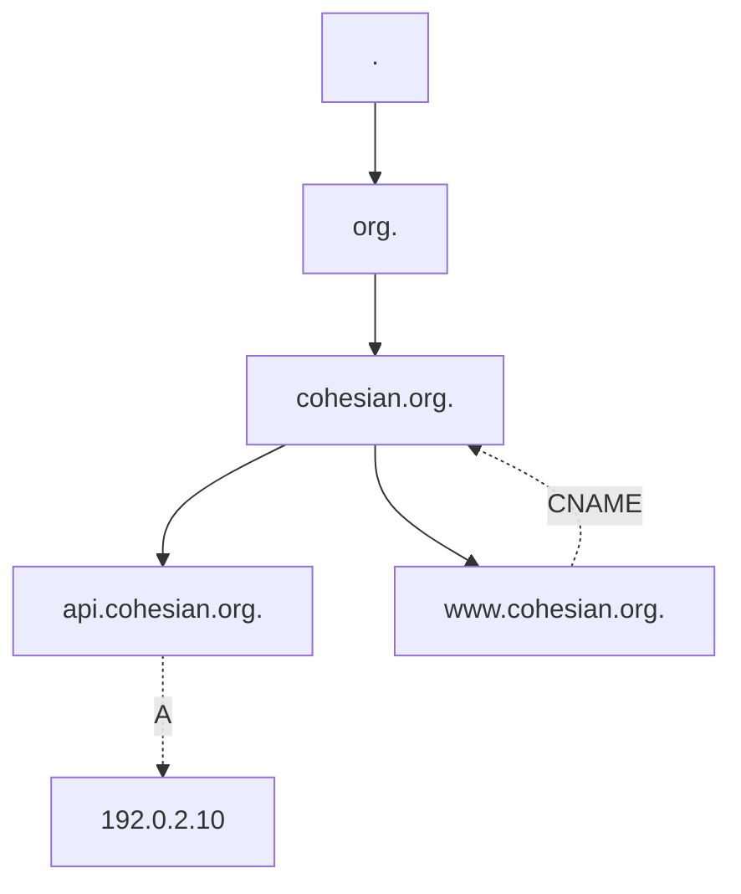

# DNS as a Tree with Typed Attachments

## 1. Components

Let:

$$
L = \text{set of DNS labels}
$$

$$
D = \text{set of domain names}
$$

$$
T = \text{set of DNS record types}
$$

$$
V = \text{set of DNS record values}
$$

A domain name is a finite sequence of labels:

$$
d = (\ell_n, \ell_{n-1}, \dots, \ell_1, \ell_0)
$$

where:

$$
\ell_0 = \texttt{.}
$$

Example:

$$
d =
(\texttt{api}, \texttt{cohesian}, \texttt{org}, \texttt{.})
$$

written as:

```text
api.cohesian.org.
```

---

## 2. Domain tree

The domain namespace is a rooted tree:

$$
\mathcal T_D = (D, E_D)
$$

where:

$$
E_D \subseteq D \times D
$$

contains parent-child relations.

Example:

```text
.
└── org
    └── cohesian
        ├── api
        ├── www
        └── home
```

The full domain name identifies the node.

Therefore:

$$
\texttt{api.cohesian.org.}
\neq
\texttt{api.blob.org.}
$$

The label `api` is not an independent global node.

Its identity depends on its complete ancestral chain.

Define:

$$
parent : D \rightharpoonup D
$$

For example:

$$
parent(\texttt{api.cohesian.org.})
=
\texttt{cohesian.org.}
$$

Define:

$$
d_1 \preceq d_2
$$

when $d_1$ is equal to or below $d_2$ in the domain tree.

Then:

$$
\texttt{v1.api.cohesian.org.}
\preceq
\texttt{api.cohesian.org.}
\preceq
\texttt{cohesian.org.}
$$

---

## 3. Attachments

Each domain node may have DNS records attached to it.

Let:

$$
R = \text{set of DNS records}
$$

Define:

$$
Att : D \to \mathcal P(R)
$$

For a domain $d$:

$$
Att(d)
=
\{r_1, r_2, \dots, r_n\}
$$

Each record is a typed value:

$$
r = (\tau, v)
$$

where:

$$
\tau \in T
$$

and:

$$
v \in V
$$

Example:

$$
Att(\texttt{api.cohesian.org.})
=
\{
(A,\texttt{192.0.2.10}),
(AAAA,\texttt{2001:db8::10}),
(TXT,\texttt{"api-service"})
\}
$$

The minimal useful DNS configuration is one domain node with one record:

$$
|D_Z| = 1
$$

$$
|Att(d)| = 1
$$

Example:

$$
Att(\texttt{cohesian.org.})
=
\{
(A,\texttt{192.0.2.10})
\}
$$

---

## 4. DNS as a flattened tree

The logical structure is hierarchical:

$$
\mathcal T_D = (D, E_D)
$$

A DNS zone can represent part of that tree as a flat map:

$$
Zone
=
\{
(d, Att(d))
\mid
d \in D_Z
\}
$$

Example:

| Domain | Attachments |
|---|---|
| `cohesian.org.` | `{A, MX, TXT}` |
| `api.cohesian.org.` | `{A, AAAA}` |
| `www.cohesian.org.` | `{CNAME}` |
| `home.cohesian.org.` | `{A}` |

The hierarchy remains encoded inside each complete domain name.

For example:

```text
api.cohesian.org.
```

contains the chain:

```text
. → org → cohesian → api
```

So DNS can be viewed as a flattened representation of a domain subtree.

---

## 5. Two-axis DNS view

A DNS zone has two important axes.

The first axis is the domain:

$$
d \in D_Z
$$

The second axis is the record type:

$$
\tau \in T
$$

Define:

$$
DNS_Z : D_Z \times T \to \mathcal P(V)
$$

Thus:

$$
DNS_Z(d,\tau)
=
\text{values attached to domain } d
\text{ under type } \tau
$$

Example:

| Domain | A | AAAA | CNAME | MX | TXT |
|---|---|---|---|---|---|
| `cohesian.org.` | `{ip_1}` | $\varnothing$ | $\varnothing$ | `{mail_1}` | `{text_1}` |
| `api.cohesian.org.` | `{ip_2}` | `{ip_6}` | $\varnothing$ | $\varnothing$ | $\varnothing$ |
| `www.cohesian.org.` | $\varnothing$ | $\varnothing$ | `{cohesian.org.}` | $\varnothing$ | $\varnothing$ |

This is a sparse rank-two representation:

$$
D_Z \times T
$$

---

## 6. Record types

Let:

$$
T =
\{
A,
AAAA,
CNAME,
MX,
NS,
TXT,
PTR,
\dots
\}
$$

### A

$$
A : D \to \mathcal P(IP_4)
$$

Example:

$$
\texttt{api.cohesian.org.}
\xrightarrow{A}
\texttt{192.0.2.10}
$$

### AAAA

$$
AAAA : D \to \mathcal P(IP_6)
$$

Example:

$$
\texttt{api.cohesian.org.}
\xrightarrow{AAAA}
\texttt{2001:db8::10}
$$

### CNAME

$$
CNAME : D \rightharpoonup D
$$

Example:

$$
\texttt{www.cohesian.org.}
\xrightarrow{CNAME}
\texttt{cohesian.org.}
$$

A CNAME is a directed jump between domain nodes.

Its target may be:

- an ancestor;
- a descendant;
- a sibling;
- a node in another zone.

### MX

$$
MX : D \to \mathcal P(\mathbb N \times D)
$$

### NS

$$
NS : D \to \mathcal P(D)
$$

### TXT

$$
TXT : D \to \mathcal P(\mathrm{String})
$$

---

## 7. Tree plus typed edges

The namespace tree is:

$$
\mathcal T_D = (D, E_D)
$$

DNS records add typed edges:

$$
E_R
=
E_A
\cup
E_{AAAA}
\cup
E_{CNAME}
\cup
E_{MX}
\cup
E_{NS}
\cup
\dots
$$

The complete DNS graph is:

$$
\mathcal G_{DNS}
=
(D \cup V,\ E_D \cup E_R)
$$

Therefore:

$$
\boxed{
\text{domain namespace} = \text{tree}
}
$$

while:

$$
\boxed{
\text{DNS with records} = \text{typed directed graph}
}
$$



Solid edges belong to the namespace tree.

Dashed edges belong to DNS records.

---

## 8. CNAME composition

Suppose:

$$
\texttt{www.cohesian.org.}
\xrightarrow{CNAME}
\texttt{cohesian.org.}
$$

and:

$$
\texttt{cohesian.org.}
\xrightarrow{A}
\texttt{192.0.2.10}
$$

Resolution follows:

$$
\texttt{www.cohesian.org.}
\xrightarrow{CNAME}
\texttt{cohesian.org.}
\xrightarrow{A}
\texttt{192.0.2.10}
$$

The composed effect is:

$$
A \circ CNAME
$$

More generally:

$$
d
\xrightarrow{CNAME^*}
d'
\xrightarrow{A \mid AAAA}
ip
$$

where $CNAME^*$ means zero or more CNAME jumps.

---

## 9. DNS zones

A DNS zone is a managed subset of the domain namespace.

Let:

$$
Z_a \subseteq D
$$

be the zone whose apex is $a$.

For example:

$$
a = \texttt{cohesian.org.}
$$

Then:

$$
Z_a
=
\{
\texttt{cohesian.org.},
\texttt{api.cohesian.org.},
\texttt{www.cohesian.org.},
\dots
\}
$$

The zone attachments are:

$$
Att_Z : Z_a \to \mathcal P(R)
$$

A descendant may be delegated to another authority using an `NS` relation.

Therefore, a zone is not defined by a maximum label depth.

It is defined by administrative authority and delegation.

---

## 10. DNS and HTTP paths

Consider:

```text
https://api.cohesian.org/users/42
```

Split it into:

$$
h = \texttt{api.cohesian.org}
$$

and:

$$
p = \texttt{/users/42}
$$

DNS receives only the hostname:

$$
h
$$

DNS does not receive the HTTP path:

$$
p
$$

DNS resolves the hostname:

$$
DNS(h) \to ip
$$

After a network connection exists, the application interprets the path:

$$
Route(p) \to handler
$$

Therefore:

$$
\boxed{
\text{DNS contains names and records, not HTTP paths}
}
$$

---

## 11. Two trees

The DNS namespace is one tree:

```text
.
└── org
    └── cohesian
        └── api
```

The application path namespace is another tree:

```text
/
└── users
    └── 42
```

They compose through the selected service:

$$
h
\xrightarrow{DNS}
ip
\xrightarrow{network}
service
\xrightarrow{Route(p)}
handler
$$

So the complete system contains:

$$
\boxed{
\mathcal T_D
+
Att
+
\mathcal G_{IP}
+
\mathcal T_P
}
$$

where:

$$
\mathcal T_D
=
\text{domain namespace tree}
$$

$$
Att
=
\text{typed DNS attachments}
$$

$$
\mathcal G_{IP}
=
\text{physical network graph}
$$

$$
\mathcal T_P
=
\text{application path tree}
$$

---

## 12. Final model

$$
\boxed{
\mathcal T_D = (D,E_D)
}
$$

$$
\boxed{
Att : D \to \mathcal P(R)
}
$$

$$
\boxed{
R \subseteq T \times V
}
$$

$$
\boxed{
DNS_Z : D_Z \times T \to \mathcal P(V)
}
$$

$$
\boxed{
Zone
=
\{
(d,Att(d))
\mid
d \in D_Z
\}
}
$$

The logical namespace is a tree.

The zone is a flattened representation of part of that tree.

Records are typed attachments to selected nodes.

The full DNS system is the namespace tree plus the typed relations attached to it.