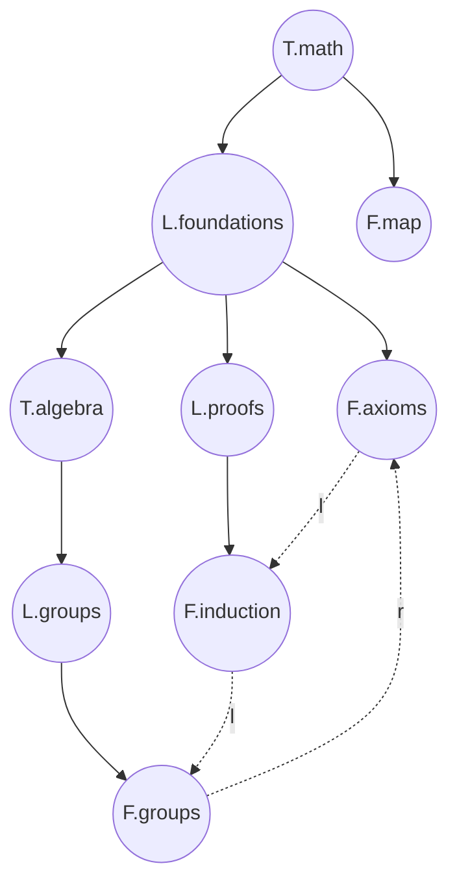

# TLF Composite

> `TLF` is a labeled composite pattern for a corpus.
> The grouping edges give the shape.
> Linear and related edges are overlays on the same fixed nodes.

## 1. Corpus Assignment

Let:

$$
\mathcal{K}
$$

denote the whole knowledge corpus.

The full graph is:

$$
G_{\mathcal{K}}
=
(V,\; E_g \sqcup E_l \sqcup E_r,\; \kappa)
$$

where:

$$
\kappa : V \to \{T,L,F\}
$$

assigns a node kind:

- `T` = topic
- `L` = lecture
- `F` = file

The edge families are:

$$
E_g = \text{grouping edges}
$$

$$
E_l = \text{linear reading edges}
$$

$$
E_r = \text{related / referential edges}
$$

Only one family defines the taken shape:

$$
\operatorname{shape}(\mathcal{K}) = (V,E_g)
$$

The others are traversal overlays:

$$
E_l,E_r \not\Rightarrow \operatorname{shape}(\mathcal{K})
$$

---

## 2. Node Kinds

The roles are not fixed depth levels.

They are labels on nodes:

$$
V_T = \kappa^{-1}(T)
\qquad
V_L = \kappa^{-1}(L)
\qquad
V_F = \kappa^{-1}(F)
$$

Composites are:

$$
V_C = V_T \cup V_L
$$

Leaves are:

$$
V_F
$$

So:

- `T` is a composite and may start a scoped view
- `L` is a composite and expands inside a scoped view
- `F` is a leaf and carries readable content

The important distinction is:

$$
T,L : \text{composite}
\qquad
F : \text{leaf}
$$

not:

$$
T \to L \to F
$$

as a required layer chain.

---

## 3. Composite Grammar

Under the grouping axis alone, the recursive grammar is:

$$
K ::= F \mid c[K_1,\dots,K_n]
\qquad
c \in \{T,L\}
$$

Equivalently:

$$
F : K
$$

and:

$$
c[X_1,\dots,X_n] : K
\qquad
c \in \{T,L\}
\qquad
X_i : K
$$

So both `T` and `L` admit the same child universe:

$$
\operatorname{child}(T),\operatorname{child}(L)
\subseteq
V_T \cup V_L \cup V_F
$$

A topic may contain a lecture.
A lecture may contain a topic.
Either may contain files.
Either may contain its own kind.

That is the composite part:

$$
c \supset \{F_1,\dots,F_a,L_1,\dots,L_b,T_1,\dots,T_m\}
$$

with:

$$
c \in \{T,L\}
$$

---

## 4. Grouping Axis

The grouping graph is:

$$
G_g = (V,E_g)
$$

with:

$$
E_g \subseteq V_C \times V
$$

Each grouping edge means containment:

$$
(u,v) \in E_g
\quad\Longleftrightarrow\quad
u \text{ contains } v
$$

In the filesystem realization, every non-root node has one grouping parent:

$$
\left|\operatorname{par}_g(v)\right| = 1
\qquad
v \neq \rho
$$

and the root has none:

$$
\operatorname{par}_g(\rho)=\varnothing
$$

Therefore:

$$
G_g \text{ is a rooted tree}
$$

or, with multiple subject roots before adding an artificial root:

$$
G_g \text{ is a rooted forest}
$$

In either case:

$$
G_g \text{ is a DAG}
$$

So the DAG is the structural contract.
The tree is the current disk-backed realization.

---

## 5. Traversal Overlays

Linear edges:

$$
E_l \subseteq V_F \times V_F
$$

Related edges:

$$
E_r \subseteq V_F \times V_F
$$

Both are leaf-only:

$$
(u,v) \in E_l \cup E_r
\quad\Rightarrow\quad
u,v \in V_F
$$

They answer different questions.

| Edge | Question | Constraint |
|------|----------|------------|
| $E_g$ | Where is this node grouped? | composite to child |
| $E_l$ | What is the next reading step? | file to file |
| $E_r$ | What else is related? | file to file |

The linear axis may be a path:

$$
F_1 \xrightarrow{l} F_2 \xrightarrow{l} F_3
$$

The related axis may fan out or cycle:

$$
F_i \xrightarrow{r} F_j
\qquad
F_j \xrightarrow{r} F_i
$$

Neither changes containment:

$$
\Delta E_l \cup \Delta E_r
\quad\not\Rightarrow\quad
\Delta E_g
$$

---

## 6. Fixed-Node Law

The layout should be a function of grouping only:

$$
p : V \to \mathbb{R}^2
$$

$$
p = \operatorname{layout}(V,E_g)
$$

So:

$$
\operatorname{layout}(V,E_g,E_l,E_r)
=
\operatorname{layout}(V,E_g)
$$

Operationally:

- add a related edge: nodes do not move
- add a next edge: nodes do not move
- move a file to another folder: nodes move
- rename a group path: structural identity changes

So the visual topology is owned by:

$$
E_g
$$

while:

$$
E_l,E_r
$$

are drawn on top.

---

## 7. Projections

The corpus admits several projections.

Grouping projection:

$$
\pi_g(G_{\mathcal{K}}) = (V,E_g)
$$

Linear projection:

$$
\pi_l(G_{\mathcal{K}}) = (V_F,E_l)
$$

Related projection:

$$
\pi_r(G_{\mathcal{K}}) = (V_F,E_r)
$$

Full traversal projection:

$$
\pi_{lr}(G_{\mathcal{K}})
=
(V_F,E_l \sqcup E_r)
$$

The important invariant is:

$$
\pi_g
\perp
\pi_l,\pi_r
$$

in the structural sense:

$$
\pi_l,\pi_r
\text{ can change while }
\pi_g
\text{ remains fixed}
$$

---

## 8. Topic Forest

Topics are special because they can start scoped views.

Let:

$$
V_T = \{v \in V \mid \kappa(v)=T\}
$$

Define topic adjacency:

$$
(T_a,T_b) \in E_T
$$

when:

1. $T_b$ is a descendant of $T_a$ in $G_g$
2. no other topic lies strictly between them

Formally:

$$
(T_a,T_b) \in E_T
\Longleftrightarrow
T_a \prec_g T_b
\;\wedge\;
\nexists T_c \in V_T:
T_a \prec_g T_c \prec_g T_b
$$

Then:

$$
\pi_T(G_{\mathcal{K}}) = (V_T,E_T)
$$

This is the topic forest:

- it hides `L`
- it hides `F`
- it keeps only topic-to-topic adjacency
- it chooses possible view origins

---

## 9. Topic-Scoped Composite

Fix an origin topic:

$$
T_0 \in V_T
$$

Inside $T_0$, lectures expand.
Files stop.
Nested topics stop as portals.

Define:

$$
\operatorname{stop}_{T_0}(x)
\Longleftrightarrow
\kappa(x)=F
\;\vee\;
(\kappa(x)=T \wedge x \neq T_0)
$$

The visible node set is:

$$
V_{T_0}
=
\{x \in \operatorname{desc}_g(T_0) \cup \{T_0\}
\mid
\text{no strict ancestor of }x\text{ below }T_0\text{ is a stop node}
\}
$$

The scoped grouping edges are:

$$
E_{g,T_0}
=
E_g \cap (V_{T_0} \times V_{T_0})
$$

Thus:

$$
\pi_{T_0}(G_{\mathcal{K}})
=
(V_{T_0},E_{g,T_0})
$$

A nested topic:

$$
T' \neq T_0
$$

appears as a single portal node:

$$
T' \in V_{T_0}
\qquad
\operatorname{child}_{\pi_{T_0}}(T')=\varnothing
$$

until it becomes the new origin.

---

## 10. Anchored Reading

For a file:

$$
f \in V_F
$$

its anchor topic is the closest topic ancestor:

$$
\operatorname{anchor}(f)
=
\max_{\prec_g}
\{T \in V_T \mid T \preceq_g f\}
$$

Then the reading page for $f$ may show:

$$
\pi_{\operatorname{anchor}(f)}(G_{\mathcal{K}})
$$

as the sidebar structure.

The file is read as a leaf.
The local topic view supplies context.
The linear and related edges supply movement.

---

## 11. Example

A valid grouping shape:

```text
T.math
|- L.foundations
|  |- F.axioms
|  |- T.algebra
|  |  `- L.groups
|  |     `- F.groups
|  `- L.proofs
|     `- F.induction
`- F.map
```

Here:

$$
T.math[L.foundations[\;F.axioms,\;T.algebra[L.groups[F.groups]],\;L.proofs[F.induction]\;],\;F.map]
: K
$$

A linear overlay may be:

$$
F.axioms \xrightarrow{l} F.induction \xrightarrow{l} F.groups
$$

A related overlay may be:

$$
F.groups \xrightarrow{r} F.axioms
$$

The grouping shape does not change.

Mermaid sketch:



The solid edges are $E_g$.
The dotted edges are $E_l$ and $E_r$.

---

## 12. Relation to Type Binder

[06-type-binder.md](06-type-binder.md) uses:

$$
T ::= t \mid d\{T\}
$$

with:

$$
t ::= l \mid c[T_1,\dots,T_n]
$$

That pattern has:

- leaves
- composites
- decorators
- one binder surface

TLF keeps the binder intuition but removes the decorator axis:

$$
K ::= F \mid c[K_1,\dots,K_n]
\qquad
c \in \{T,L\}
$$

Then it adds edge-family overlays:

$$
G_{\mathcal{K}}
=
(V,E_g \sqcup E_l \sqcup E_r,\kappa)
$$

So TLF is not mainly:

$$
d\{K\}
$$

It is mainly:

$$
c[K_1,\dots,K_n] + \text{orthogonal traversal edges}
$$

The closest binder reading is:

$$
C \Rightarrow K
$$

where `K` is the corpus binder and `T/L/F` are admitted node roles.

---

## 13. Laws

### Shape law

$$
\operatorname{shape}(\mathcal{K}) = (V,E_g)
$$

### Composite law

$$
T,L : K^* \to K
$$

or:

$$
c[K_1,\dots,K_n] : K
\qquad
c \in \{T,L\}
$$

### Leaf law

$$
F : K
\qquad
\operatorname{child}_g(F)=\varnothing
$$

### Traversal law

$$
E_l,E_r \subseteq V_F \times V_F
$$

### Projection law

$$
\pi_g,\pi_l,\pi_r
$$

are different views of the same corpus, not different corpora.

### Portal law

$$
T' \neq T_0
\quad\Rightarrow\quad
T' \text{ stops inside } \pi_{T_0}
$$

### Stability law

$$
\Delta(E_l \cup E_r)
\not\Rightarrow
\Delta(V,E_g,\kappa)
$$

---

## 14. Build-Time Reading

The construction can be read as three passes.

### Pass A: structure

$$
\text{paths}
\longmapsto
(V,E_g,\kappa,\operatorname{index}_g)
$$

This assigns:

- node identity
- node kind
- grouping parent
- grouping index

### Pass B: traversal

For each file:

$$
F_i \longmapsto
\{(F_i,F_j)\in E_l\}
\cup
\{(F_i,F_k)\in E_r\}
$$

from local metadata and body links.

### Pass C: projection

Choose a view:

$$
\pi_g,\quad \pi_T,\quad \pi_{T_0},\quad \pi_l,\quad \pi_r
$$

and render only that projection.

The corpus does not need a second source of truth.
The filesystem gives $E_g$.
The files give $E_l$ and $E_r$.

---

## 15. Compression

The whole pattern compresses to:

$$
\boxed{
G_{\mathcal{K}}
=
(V,E_g \sqcup E_l \sqcup E_r,\kappa)
}
$$

with:

$$
\boxed{
\operatorname{shape}(\mathcal{K})=(V,E_g)
}
$$

and:

$$
\boxed{
K ::= F \mid c[K_1,\dots,K_n],
\quad c\in\{T,L\}
}
$$

So:

- `T/L/F` define roles
- $E_g$ defines topology
- $E_l$ defines reading sequence
- $E_r$ defines non-linear relation
- projections define views
